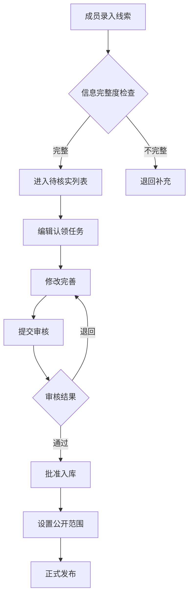
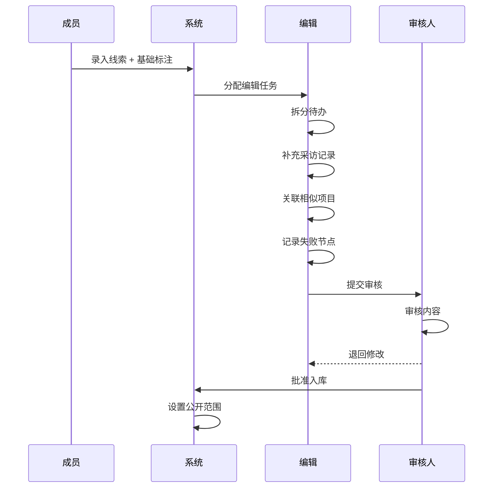

# 创业尸体库线索协作平台 - 产品需求文档

## 1. 产品概述

面向内容编辑团队的专业创业项目信息收集与整理平台，用于归档已停止运营的创业公司案例。系统支持多角色协作，包含线索收集、待核实列表、编辑工作台、发布审核和数据概览五大核心模块，帮助团队高效管理从线索发现到内容发布的完整工作流。

目标用户为内容编辑团队的成员、编辑和审核人员，通过标注行业、可信度、优先级等维度，对创业失败案例进行结构化整理。

## 2. 核心功能

### 2.1 用户角色

| 角色 | 描述 | 核心权限 |
|------|------|----------|
| 成员 | 线索录入人员 | 录入项目信息、标注基础属性、提交线索 |
| 编辑 | 内容深度加工人员 | 拆分待办、补充采访记录、关联项目、记录失败节点 |
| 审核人 | 内容终审人员 | 退回修改、批准入库、设置公开范围 |

### 2.2 功能模块

1. **线索收集页**：录入项目基础信息，包含项目名称、官网状态、产品截图、新闻来源、融资线索、停运证据
2. **待核实列表**：展示所有待验证的线索，支持筛选、搜索和批量操作
3. **编辑工作台**：编辑人员的工作主战场，支持任务拆分、采访记录、相似项目关联、失败节点和争议点记录
4. **发布审核**：审核人员对编辑完成的内容进行审核，支持退回、批准和设置公开范围
5. **数据概览**：Dashboard 展示关键运营数据

### 2.3 页面详情

| 页面名称 | 模块名称 | 功能描述 |
|----------|----------|----------|
| 线索收集页 | 信息录入表单 | 项目名称、官网状态(正常/重定向/无法访问)、产品截图上传、新闻来源链接、融资阶段和金额、停运证据描述 |
| 线索收集页 | 标注面板 | 行业分类(电商/社交/金融/教育等)、可信度等级(高/中/低)、优先级(紧急/高/中/低)、负责人分配 |
| 待核实列表 | 筛选器 | 按状态、行业、可信度、优先级、时间范围筛选 |
| 待核实列表 | 列表视图 | 卡片式展示线索，支持批量选择和操作 |
| 待核实列表 | 搜索栏 | 支持项目名称、关键词全文搜索 |
| 编辑工作台 | 任务面板 | 将线索拆分为多个待办事项，设置截止日期和指派人 |
| 编辑工作台 | 采访记录 | 记录采访对象、时间、内容摘要和关键发现 |
| 编辑工作台 | 项目关联 | 关联相似项目、竞品对比、关联行业事件 |
| 编辑工作台 | 失败分析 | 填写失败节点类型(资金链断裂/市场失配/团队问题/政策因素)、时间线和详细描述 |
| 编辑工作台 | 争议记录 | 记录存疑信息和待核实点 |
| 发布审核 | 审核队列 | 展示待审核内容列表 |
| 发布审核 | 审核详情 | 查看完整内容、添加审核意见、退回或批准操作 |
| 发布审核 | 权限设置 | 设置内容公开范围(团队内/合作伙伴/公开) |
| 数据概览 | 统计卡片 | 本周新增线索数、待核实数量、审核通过率 |
| 数据概览 | 来源质量 | 按新闻来源统计线索数量和质量评分 |
| 数据概览 | 编辑进度 | 各编辑人员的工作完成进度 |
| 数据概览 | 时间趋势 | 线索增长趋势图 |

## 3. 核心流程

### 3.1 线索完整生命周期

### 3.2 角色权限流程

## 4. 用户界面设计

### 4.1 设计风格

- **设计理念**：档案馆美学 - 将创业失败案例视为珍贵的商业档案，采用专业、沉稳的视觉语言
- **主色调**：深青灰色 (#1a2332) 搭配暖琥珀色 (#d4a574) 点缀
- **辅助色**：
  - 警示红 (#dc3545) - 失败/危险标识
  - 成功绿 (#28a745) - 已入库/通过
  - 信息蓝 (#007bff) - 链接和交互
- **背景色**：浅灰 (#f5f6f8) 搭配白色卡片
- **字体**：
  - 标题：思源黑体 Bold / Noto Sans SC Bold
  - 正文：思源黑体 Regular / Noto Sans SC Regular
  - 数据：JetBrains Mono (数字展示)
- **布局风格**：顶部导航 + 侧边栏菜单，卡片式内容展示
- **图标风格**：线性图标，2px 描边

### 4.2 页面设计概览

| 页面名称 | 主要元素 | 视觉风格 |
|----------|----------|----------|
| 线索收集页 | 左侧表单 + 右侧预览卡片 | 清晰的表单分区，实时预览效果 |
| 待核实列表 | 顶部筛选 + 网格卡片列表 | 紧凑高效，支持批量操作 |
| 编辑工作台 | 左侧项目信息 + 右侧任务面板 | 左右分栏，支持拖拽排序 |
| 发布审核 | 三栏布局：队列/详情/操作 | 清晰的工作流界面 |
| 数据概览 | 顶部统计卡片 + 中部图表 + 底部列表 | 数据驱动型 Dashboard |

### 4.3 响应式设计

- 桌面优先设计 (1280px+)
- 平板适配 (768px-1279px)：侧边栏收起为图标
- 移动端降级 (320px-767px)：底部导航，单列布局

### 4.4 状态设计

- **待核实**：浅蓝背景 + 蓝色标签
- **编辑中**：浅黄背景 + 黄色标签
- **待审核**：浅橙背景 + 橙色标签
- **已入库**：浅绿背景 + 绿色标签
- **已发布**：深绿背景 + 白色文字
- **已退回**：浅红背景 + 红色标签

## 5. 数据字段设计

### 5.1 线索数据

| 字段名 | 类型 | 描述 |
|--------|------|------|
| id | UUID | 唯一标识 |
| project_name | string | 项目名称 |
| website_status | enum | 官网状态 |
| screenshots | array | 产品截图URL列表 |
| news_sources | array | 新闻来源链接列表 |
| funding_info | object | 融资信息 |
| shutdown_evidence | text | 停运证据描述 |
| industry | enum | 行业分类 |
| credibility | enum | 可信度等级 |
| priority | enum | 优先级 |
| assignee | user_id | 负责人 |
| status | enum | 当前状态 |
| created_by | user_id | 创建人 |
| created_at | timestamp | 创建时间 |
| updated_at | timestamp | 更新时间 |

### 5.2 任务数据

| 字段名 | 类型 | 描述 |
|--------|------|------|
| id | UUID | 唯一标识 |
| lead_id | UUID | 关联线索ID |
| title | string | 任务标题 |
| description | text | 任务描述 |
| assignee | user_id | 指派人 |
| due_date | date | 截止日期 |
| status | enum | 任务状态 |
| created_at | timestamp | 创建时间 |

### 5.3 采访记录数据

| 字段名 | 类型 | 描述 |
|--------|------|------|
| id | UUID | 唯一标识 |
| lead_id | UUID | 关联线索ID |
| interviewee | string | 采访对象 |
| interview_date | date | 采访日期 |
| content | text | 采访内容 |
| key_findings | array | 关键发现 |
| created_at | timestamp | 创建时间 |

## 6. 技术约束

- 前端：React 18 + TypeScript + Tailwind CSS
- 状态管理：React Context + useReducer
- 数据：使用 Mock 数据模拟后端接口
- 图标：Lucide React
- 图表：Recharts
- 日期处理：date-fns
- 表单验证：React Hook Form + Zod
- 拖拽排序：@dnd-kit/core
