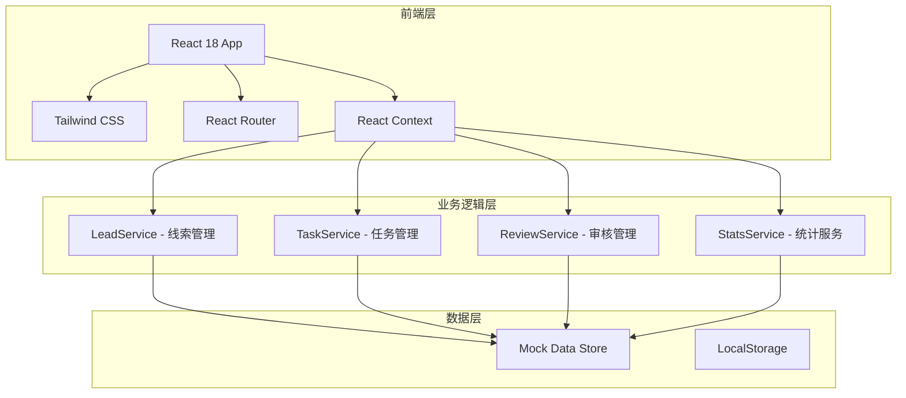
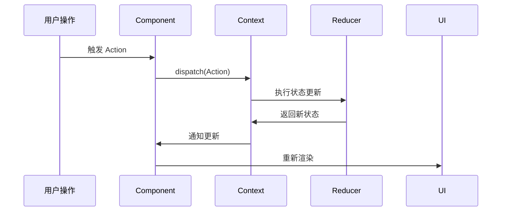

# 创业尸体库线索协作平台 - 技术架构文档

## 1. 架构设计



## 2. 技术选型

| 类别 | 技术栈 | 版本 |
|------|--------|------|
| 框架 | React | 18.x |
| 语言 | TypeScript | 5.x |
| 构建工具 | Vite | 5.x |
| 样式 | Tailwind CSS | 3.x |
| 路由 | React Router DOM | 6.x |
| 图表 | Recharts | 2.x |
| 图标 | Lucide React | 最新版 |
| 表单验证 | React Hook Form + Zod | 最新版 |
| 拖拽 | @dnd-kit/core | 最新版 |
| 日期处理 | date-fns | 3.x |
| UUID | uuid | 9.x |

## 3. 路由定义

| 路由路径 | 页面名称 | 权限要求 |
|----------|----------|----------|
| / | 首页/数据概览 | 所有登录用户 |
| /leads | 线索收集页 | 所有用户 |
| /leads/new | 新建线索 | 所有用户 |
| /leads/:id | 线索详情 | 所有用户 |
| /pending | 待核实列表 | 所有用户 |
| /workbench | 编辑工作台 | 编辑及以上 |
| /reviews | 发布审核 | 审核人 |
| /reviews/:id | 审核详情 | 审核人 |

## 4. 状态管理设计

### 4.1 全局 Context 结构

```typescript
interface AppState {
  currentUser: User | null;
  leads: Lead[];
  tasks: Task[];
  interviews: Interview[];
  filters: FilterState;
}

interface User {
  id: string;
  name: string;
  role: 'member' | 'editor' | 'reviewer';
  avatar: string;
}
```

### 4.2 状态更新流程



## 5. Mock 数据结构

### 5.1 线索数据示例

```typescript
const mockLeads: Lead[] = [
  {
    id: '1',
    project_name: '小蓝单车',
    website_status: 'shutdown',
    industry: '出行',
    credibility: 'high',
    priority: 'high',
    status: 'pending_review',
    funding_info: { round: 'B轮', amount: '1亿' },
    created_at: '2024-01-15T10:00:00Z',
  },
];
```

### 5.2 任务数据示例

```typescript
const mockTasks: Task[] = [
  {
    id: '1',
    lead_id: '1',
    title: '核实融资信息',
    description: '联系投资人确认B轮融资细节',
    status: 'todo',
    assignee: 'editor-1',
    due_date: '2024-01-20',
  },
];
```

## 6. 组件架构

```
src/
├── components/
│   ├── layout/
│   │   ├── Header.tsx
│   │   ├── Sidebar.tsx
│   │   └── Layout.tsx
│   ├── leads/
│   │   ├── LeadCard.tsx
│   │   ├── LeadForm.tsx
│   │   └── LeadDetail.tsx
│   ├── tasks/
│   │   ├── TaskBoard.tsx
│   │   └── TaskItem.tsx
│   ├── review/
│   │   ├── ReviewQueue.tsx
│   │   └── ReviewPanel.tsx
│   ├── stats/
│   │   ├── StatCard.tsx
│   │   └── Charts.tsx
│   └── common/
│       ├── Button.tsx
│       ├── Input.tsx
│       ├── Select.tsx
│       └── Badge.tsx
├── pages/
│   ├── Dashboard.tsx
│   ├── Leads.tsx
│   ├── Pending.tsx
│   ├── Workbench.tsx
│   └── Reviews.tsx
├── contexts/
│   └── AppContext.tsx
├── services/
│   ├── leadService.ts
│   ├── taskService.ts
│   └── statsService.ts
├── hooks/
│   └── useApp.ts
├── types/
│   └── index.ts
├── data/
│   └── mockData.ts
└── utils/
    └── helpers.ts
```

## 7. 核心业务逻辑

### 7.1 线索状态流转

```
new -> pending_verification -> in_review -> approved -> published
                    ↓                              ↓
              returned                       rejected
                    ↓                              ↓
           in_progress                      in_revision
```

### 7.2 权限控制矩阵

| 操作 | 成员 | 编辑 | 审核人 |
|------|------|------|--------|
| 录入线索 | ✓ | ✓ | ✓ |
| 编辑线索 | ✓ | ✓ | ✓ |
| 提交审核 | - | ✓ | - |
| 退回修改 | - | - | ✓ |
| 批准入库 | - | - | ✓ |
| 设置公开范围 | - | - | ✓ |
| 查看统计数据 | ✓ | ✓ | ✓ |

## 8. 性能优化

- 使用 React.memo 优化列表渲染
- 虚拟滚动处理大数据列表
- 懒加载路由组件
- 缓存筛选条件和搜索结果
